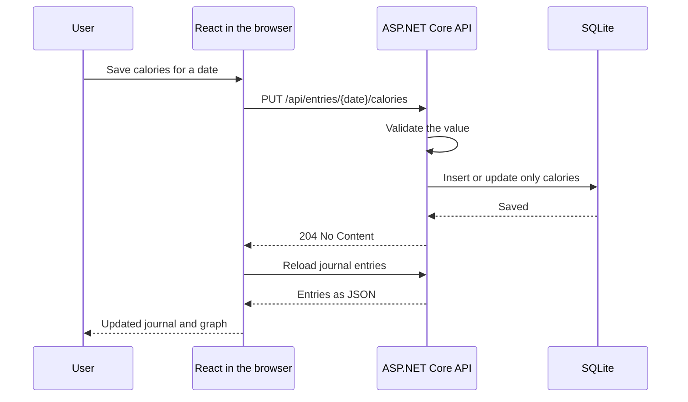
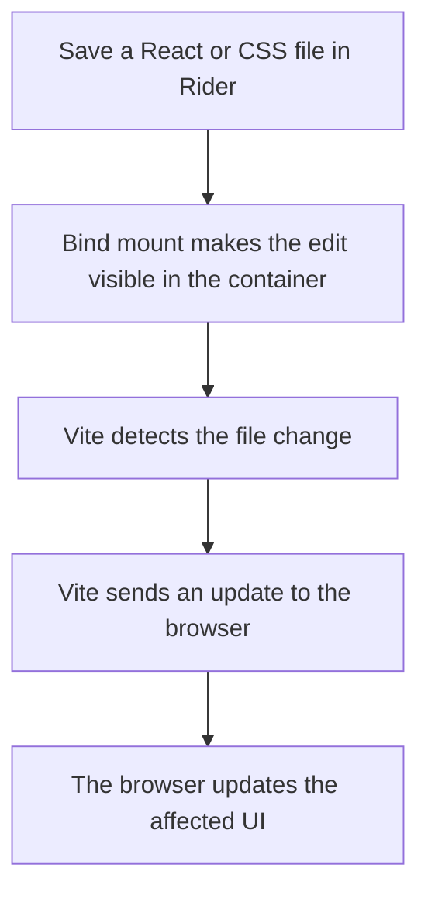
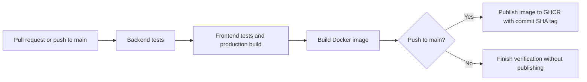

# DOD — discipline over dopamine

A personal journal for morning weight and evening calories burned, built with .NET 10, React, and SQLite. This README is both a guide to using the app and a tutorial explaining how it is built. As the app grows, new features should add their design decisions and explanations here.

## Contents

- [1. Install and run the app](#1-install-and-run-the-app)
- [2. Use your journal](#2-use-your-journal)
- [3. Develop and test locally](#3-develop-and-test-locally)
- [4. Understand the architecture and decisions](#4-understand-the-architecture-and-decisions)
- [5. Understand Docker and persistent data](#5-understand-docker-and-persistent-data)
- [6. How hot reload works inside Docker](#6-how-hot-reload-works-inside-docker)
- [7. Understand and use CICD](#7-understand-and-use-cicd)
- [8. Follow a change from idea to deployment](#8-follow-a-change-from-idea-to-deployment)
- [9. API reference](#9-api-reference)
- [10. Troubleshooting](#10-troubleshooting)
- [11. Set up a fresh Ubuntu VPS](#11-set-up-a-fresh-ubuntu-vps)
- [12. Future ideas](#12-future-ideas)
- [VPS deployment tutorial](docs/vps.md)
- [Accounts, friends, challenges, and upgrade guide](docs/social.md)
- [Daily activities, XP, levels, and admin guide](docs/motivation.md)

## 1. Install and run the app

### Prerequisites

For the container setup, install Git and [Docker Desktop](https://docs.docker.com/desktop/setup/install/mac-install/), which includes Docker Compose. On an Apple Silicon Mac, choose the Apple Silicon installer. Open Docker Desktop and wait for it to start.

You do not need to install .NET or Node.js on your Mac to run this container setup: the build uses them inside Docker.

Get the project if you do not already have it:

```sh
git clone https://github.com/witoss/dod.git
cd dod
```

Open `Dod.slnx` in Rider. Open **View → Tool Windows → Terminal** to run commands. Unless stated otherwise, commands in this guide run from the repository root—the folder containing `compose.yaml`.

Check Docker is available:

```sh
docker --version
docker compose version
```

### Configure your login

On first setup, copy the example configuration:

```sh
cp .env.example .env
```

If you already have `.env`, edit it instead of copying over it. Set your own unique password:

```dotenv
TRACKER_PASSWORD=replace-with-your-own-long-password
```

This password proves ownership when claiming the original journal after upgrading to individual accounts. It is not your new account, Docker, Mac, or GitHub password. `.env` is excluded from Git and the Docker build context.

### Start the app

```sh
docker compose up --build -d
```

Open **http://localhost:8080**. Choose **Claim existing journal**, enter your `TRACKER_PASSWORD`, and choose your personal nickname and a new account password. New users choose **Create account**. Later, sign in with your nickname and account password. See the [account upgrade guide](docs/social.md#upgrade-an-existing-journal).

The first build downloads dependencies and takes longer. Later builds reuse cached work. `--build` builds the image before starting; `-d` leaves the container running in the background.

### Everyday commands

The page footer identifies the displayed release, for example **Build a0c3377**. Compare it with the commit SHA in the successful GitHub deployment; hover over the label to see the full SHA. Refresh the page after deployment to load the new frontend. This identifies the loaded frontend, not a live check for newer releases.

GitHub Actions passes the full commit SHA as Docker's `APP_REVISION` build argument. Vite embeds it in the frontend during the image build, so no runtime secret or server configuration is needed. The development server displays **Development**; production builds without a revision (including the default local Docker build) display **Local build**.

| Task | Command |
| --- | --- |
| Start the existing app | `docker compose up -d` |
| Apply code changes | `docker compose up --build -d` |
| See container status | `docker compose ps` |
| Follow application logs | `docker compose logs -f app` |
| Stop without removing the container | `docker compose stop` |
| Stop and remove the container | `docker compose down` |

Press Ctrl+C to stop following logs; the app keeps running. Both stopping and removing the container preserve the named data volume. **`docker compose down -v` deletes that volume and your journal.**

## 2. Use your journal

### Record a day

1. Select the date above the entry forms. It defaults to your browser's local date.
2. In the morning, enter your weight in kilograms and select **Save weight**.
3. In the evening, enter calories burned in kilocalories (kcal) and select **Save calories**.
4. Use **Edit** in the journal to correct an earlier day or fill in a missed measurement.

The two saves are independent: saving calories preserves the weight for that date. Saving a measurement again replaces its previous value. A missing value is different from a recorded zero.

Use a consistent definition of calories burned, such as the total daily number reported by your watch. The app records the number you provide; it does not estimate it.

### Friends, challenges, and your profile

Use **Friends & challenges** to search by exact nickname, send and accept friend requests, create a challenge for a chosen number of weeks, and invite your accepted friends. Each invited person accepts before sharing progress. A challenge's leaderboard calculates kilograms lost from measurements inside its dates. Use **Profile** to edit your nickname or upload an avatar. Challenge participants can see your daily weights within the challenge dates. Calories and weights outside the challenge remain private. [Read the full guide and scoring rules](docs/social.md).

### Daily activities and experience

The top of the page shows your **XP and level**. In **Daily activities**, report whether you met each daily goal, such as avoiding sweets or eating after the displayed cutoff. The starter goals award 10 XP each. Saving a weight automatically earns 10 XP once per date; corrections do not award it twice. New rewards show a congratulatory popup.

Every 100 XP advances one level. Levels do not unlock features yet. Manual corrections adjust XP and can lower a level. Activities use UTC dates for XP eligibility; future dates cannot earn rewards.

The original journal owner has an **Admin** tab for viewing all users and challenges and creating or editing activity rules. Existing weights are preserved but receive no retroactive XP. See [the detailed rules, admin guide, and migration notes](docs/motivation.md).

### Kilograms lost

The main page shows **kg lost**: your earliest recorded weight minus your latest recorded weight, ordered by entry date across the whole journal. For example, 90 kg followed by 87.5 kg shows **2.50 kg lost**. A negative value means weight gained. Days without weight are ignored; one weight shows 0.00, and no weights shows a dash. Saving or correcting a weight updates the summary. Selecting a date or calorie chart period does not limit this all-time total.

### Configure the reference and read the graph

Below the entry forms, find **Your calorie balance**. Enter a **Daily calorie reference** and select **Save reference**. The reference is saved in SQLite and survives restarts. It is the default calories eaten for days without a specific intake entry.

Use the optional **Calories eaten** form for the selected day to override that default. A recorded zero is an explicit value. Select **Use reference**, or save an empty intake field, to clear the override. Saving intake preserves that day's weight and calories burned.

The calculation is:

```text
calories eaten = daily entry, if specified; otherwise the reference
balance = calories eaten − calories burned
```

| Reference | Burned | Balance | Meaning |
| --- | --- | --- | --- |
| 2200 kcal | 2500 kcal | −300 kcal | Burned more than the reference |
| 2200 kcal | 1800 kcal | +400 kcal | Burned less than the reference |
| 2200 kcal | 2200 kcal | 0 kcal | Matched the reference |

Choose a 7-, 14-, or 30-day period ending on the date selected above the entry forms. Hover, tap, or keyboard-focus a day for details. Expand the table below the graph to read the same daily balances as text.

Missing days are excluded from the average; a recorded zero is included. Changing the reference recalculates historical days without intake overrides; days with recorded intake keep their own value. The app uses one current reference, not a separate historical reference for each day.

### Period summary and cumulative chart

The **Cumulative balance** chart below the daily bars adds the daily balances within the selected 7-, 14-, or 30-day period. **Period total** shows the final sum. The running total starts from zero at the start of each selected period; it does not include earlier dates.

Each day contributes `calories eaten − calories burned`, taking the recorded intake when available and the daily reference otherwise. For example, daily balances of −300, +100, and −200 produce running totals of −300, −200, and −400 kcal.

Missing days appear as gaps and contribute nothing. The recorded-day count shows how complete the period is. The sum continues at the next recorded day, and a recorded zero balance remains a valid point. Hover, tap, or focus a point for its daily and cumulative values, or open the cumulative table. Changing the period, reference, or a calorie entry recalculates the summary.

Days using the reference have estimated intake; days with an override use your recorded intake. Both charts and their tables use the same rule.

## 3. Develop and test locally

### Run the development servers

For development outside Docker, install the **.NET 10 SDK** and **Node.js 24**. The SDK includes tools to build the backend; Node.js runs the frontend development tools.

In one terminal, start the API with file watching:

```sh
ASPNETCORE_ENVIRONMENT=Development ASPNETCORE_URLS=http://localhost:5080 dotnet watch --project src/Dod.Api run
```

In a second terminal:

```sh
cd src/Dod.Web
npm ci
npm run dev
```

Open the Vite URL printed in the second terminal, normally `http://localhost:5173`. `npm ci` installs the dependency versions recorded in `package-lock.json`. Vite serves the React frontend and forwards `/api` requests to the backend at port 5080.

Save a React or CSS file to see Vite update the browser. Save C# code to let `dotnet watch` apply a supported change or restart the API.

Development also requires an account; create one through the UI. To claim a pre-existing local journal, supply `Tracker__Password` to the API process and use **Claim existing journal**. Keep development servers on loopback. The root `.env` is read by Docker Compose; `dotnet watch` does not automatically load it.

The local API uses `data/dod.db` relative to its working directory unless you set `Storage__Path`. This is separate from the database in Docker's named volume, so development and container runs can have different entries.

### Run checks

From the repository root:

```sh
dotnet test Dod.slnx --configuration Release
npm --prefix src/Dod.Web ci
npm --prefix src/Dod.Web test
npm --prefix src/Dod.Web run build
```

Backend integration tests call the HTTP API and use temporary real SQLite databases. Motivation tests cover once-per-day rewards, concurrent weight saves, corrected reports, level boundaries, admin authorization, retired activities, reward snapshots, and migration from the previous schema. They check independent updates, validation, password enforcement, persistence, reference settings, and upgrading the original database without losing measurements.

Frontend tests cover local calendar dates and balance calculations, including missing entries, zero values, and changing the reference. The frontend build checks TypeScript and generates production assets. Automated browser tests are not currently part of CI.

## 4. Understand the architecture and decisions

These steps explain the design as it stands and why each piece was introduced.

### Step 1: Start with the daily habit

The first requirement was small: one morning weight and one evening calorie entry per date. That led to independent measurement endpoints and one database row per calendar day.

A date is stored as a calendar date, such as `2026-09-29`, rather than an instant converted to UTC. This prevents a check-in near midnight from moving to another day because of a time-zone conversion.

### Step 2: Separate the screen from storage

React renders the screen and handles user interaction. TypeScript helps catch mistakes in the frontend's data handling. ASP.NET Core validates requests and persists measurements.



The server validates input even though the forms also have constraints: an API can be called without using the website. Invalid values return HTTP 400 instead of being stored.

### Step 3: Keep the backend small

The MVP uses one backend project with feature folders. There is no need yet for multiple services or separate domain, application, and infrastructure projects. Organizing by feature keeps related code easy to locate.

```text
Dod.slnx                          Rider/.NET solution
src/Dod.Api/Program.cs             Startup, authentication, and routing
src/Dod.Api/Entries/               Measurement endpoints and SQLite store
src/Dod.Api/Settings/              Calorie-reference endpoints
src/Dod.Web/src/main.tsx           Daily entry forms and journal
src/Dod.Web/src/calories/          Reference form, balance calculation, and graph
tests/Dod.Api.Tests/              API and persistence tests
Dockerfile                        Production image build
compose.yaml                      Local production-style container setup
.github/workflows/ci.yml           Automated checks and image publishing
docs/devops.md                    Hosting, backups, and rollback guide
```

The settings endpoints currently share the SQLite store with entries. If storage responsibilities grow, a dedicated persistence module can become useful. Add structure when it solves a concrete problem.

### Step 4: Persist data with SQLite

SQLite stores this personal journal in a file, so the MVP does not need a separate database server. SQL values are passed as parameters. Each measurement save performs an atomic insert-or-update for just its own field.

The container design uses one app instance and persistent disk. If the app later needs multiple instances or more complex multi-user hosting, reassess the storage design and consider a server database such as PostgreSQL.

### Step 5: Protect the personal journal

The app now uses individual nickname/password accounts and ASP.NET Core session cookies. Passwords are stored using the framework's password hasher. All journal and calorie-reference operations use the signed-in user's ID; another user's journal cannot be selected through request parameters.

The old `TRACKER_PASSWORD` is used only to claim the reserved original journal, once. It is not a shared login or a password-reset mechanism. Public hosting requires HTTPS. Session keys persist beside the database, and mutations require antiforgery tokens. See [the authentication decisions and limitations](docs/social.md#implementation-decisions).

### Step 6: Add the reference without rewriting measurements

The reference is stored separately from daily measurements. The frontend derives balances from the saved reference and the existing calorie entries. Daily intake overrides are stored on the entry as nullable `CaloriesEaten`. A null means use the reference; zero is a real measurement. Balances are calculated when displayed, so changing the reference affects only days without overrides.

SQLite's `user_version` records the schema version. The version 2 startup migration adds the reference table in a transaction and adopts the original unversioned database without deleting entries. Version 3 adds nullable `CaloriesEaten` to existing entries, leaving their measurements intact. Version 4 introduces accounts, per-user journal ownership, friendships, challenges, and avatars. Existing entries and the reference are reserved for the original owner until claimed. Tests exercise upgrades from older schemas without losing measurements. Version 5 adds activity definitions, daily reports, and the original owner’s admin role. Existing weights are preserved with zero retrospective XP. Future schema changes should introduce a new migration version.

### Step 7: Package one deployable app

During development, Vite and .NET run as separate processes. In the production image, Vite has already compiled React into static HTML, JavaScript, and CSS. ASP.NET serves those files and the API from the same address.

The browser still runs React. Node.js and Vite do not need to run in the production container.

## 5. Understand Docker and persistent data

### Image, container, and volume

| Term | Meaning in this project |
| --- | --- |
| Image | A packaged runtime and a built version of the app |
| Container | A running instance of that image |
| Named volume | Docker-managed storage holding the SQLite database |
| Bind mount | A host folder shared with a container; useful for source code during development |
| Dockerfile | Instructions for building an image |
| Compose file | Instructions for running containers, connecting ports, and attaching storage |

On your Mac, Docker Desktop runs the Linux containers through a Linux virtual machine. You normally interact with them through Docker commands rather than managing that machine yourself.

### Follow the production build

The [Dockerfile](Dockerfile) has three stages:

1. **Frontend build:** use Node.js to install dependencies and compile React.
2. **Backend build:** use the .NET SDK to publish the API, then copy the frontend assets into `wwwroot`.
3. **Runtime:** copy the finished app into an ASP.NET runtime image and run it as a non-root user.

The final image does not need the Node.js build tools or .NET SDK. Docker caches build steps and can reuse them when their inputs have not changed. Dependencies are copied and installed before the rest of the source so ordinary code edits can reuse dependency installation steps.

### Reach the app from your browser

Compose publishes this port mapping:

```yaml
ports:
  - "127.0.0.1:8080:8080"
```

The first `8080` is the port on your Mac; the second is inside the container. `127.0.0.1` limits access to your own machine. Your browser connects to the Mac's port, and Docker forwards the connection to ASP.NET.

### Preserve the database

Compose attaches the named volume `tracker-data` at `/data`. The image sets `Storage__Path=/data/dod.db`, so the API writes its database into that volume.

Replacing the app container does not replace the volume. Your records survive stopping Docker, restarting your Mac, and rebuilding the image. Volumes can still be deleted or lost, so they are not a substitute for backups. See the [backup and restore guide](docs/devops.md#4-backup-and-restore).

## 6. How hot reload works inside Docker

**This section explains a development setup we can add next. The current `compose.yaml` builds the production app; it does not enable hot reload.** The local development commands in section 3 already provide file watching outside Docker.

### Why the current image needs rebuilding

The production Dockerfile copies source code into the build. Editing a file in Rider changes your Mac's file, not the copy used to create an existing image. To include those edits, run:

```sh
docker compose up --build -d
```

### Share source files during development

A development container can use a bind mount. For example, this fragment shares only the React source folder with a container whose project is at `/app`:

```yaml
# Illustration only: this is not a complete Compose service.
volumes:
  - ./src/Dod.Web/src:/app/src
```

Rider edits the files on your Mac. The container sees those same files at `/app/src`. The container then runs Vite's development server instead of serving prebuilt assets.



**Vite performs hot reload; Docker supplies the environment.** Vite maintains a connection with the browser and sends updated modules. This is called *hot module replacement*. Many edits update the UI without a full page reload and can preserve component state; some changes still require a reload.

The backend follows the same pattern: share the C# source and run `dotnet watch`. It applies supported changes while running or restarts the API when required.

### What a complete development Compose setup would need

A future `compose.dev.yaml` would run a Node.js container for Vite and a .NET SDK container for the API. It would need source mounts, dependency storage, development commands, ports, and a separate development database volume.

Vite would listen on `0.0.0.0` inside its container so Docker can forward connections to it, while the published host port can remain bound to `127.0.0.1`. The API must likewise listen on an interface reachable from the other container.

There is one networking detail: inside the frontend container, `localhost` refers to that container. Its API proxy must target the backend's Compose service name, for example `http://api:5080`, rather than the current local-development proxy address `http://localhost:5080`.

Mounting an entire frontend project also hides files already present at the target path, potentially including `node_modules`. A complete setup must keep Linux container dependencies separate from the Mac's dependencies. On systems where file-change events do not propagate reliably, the watchers may need polling.

| Change | Typical development behavior |
| --- | --- |
| React component or CSS | Save; Vite updates the browser |
| C# code | Save; .NET applies the change or restarts |
| Dependencies | Reinstall in the development environment; rebuild if baked into its image |
| Dockerfile or runtime version | Rebuild the image |
| Check the deployable package | Build and test the production image |

The workflow is: edit with hot reload, run tests, then test the production image before shipping. A development container includes tools and shared source that the production package does not need.

## 7. Understand and use CI/CD

### What the terms mean

**Continuous integration (CI)** automatically checks changes when they reach GitHub. It helps catch problems before they enter the main branch.

**Continuous delivery** produces a deployable artifact after checks pass. Here, the artifact is a Docker image stored in GitHub Container Registry (GHCR).

**Continuous deployment** automatically updates a running environment. The app build workflow does not do that. The separate **Deploy to VPS** workflow automatically deploys after **Verify and package** succeeds for a push to `main`. It also supports manual releases. Local containers are not updated by GitHub.

### Follow the current workflow

Read [.github/workflows/ci.yml](.github/workflows/ci.yml) alongside this explanation.



The `test` job installs .NET and Node.js on a temporary GitHub runner, then runs backend tests, frontend tests, and the frontend build. The `container` job waits for it to pass before building the image.

| Trigger | Checks and image build | Publish to GHCR | Deploy a website |
| --- | --- | --- | --- |
| Pull request | Yes | No | No |
| Push to `main` | Yes | Yes | After successful CI, through Deploy to VPS |
| Manual workflow run | Yes | No | No |

A published image is named `ghcr.io/<owner>/<repository>:<commit-sha>`. The SHA identifies the source revision used for the build, so you can select a specific release instead of relying on an ambiguous `latest` tag.

The publishing job uses GitHub's provided `GITHUB_TOKEN` with package-write permission. It does not need your application's `.env` password. Application secrets are supplied when a container runs, not built into its image.

### Use the pipeline

1. Create a branch for a change and run the local checks in section 3.
2. Commit and push the branch to GitHub, then open a pull request into `main`.
3. Open the pull request's checks or the repository's **Actions** tab. Read the failing step's logs if a check fails.
4. Merge after checks pass. The push to `main` runs the workflow and publishes an image if all steps succeed.
5. Inspect the workflow and the repository's associated package to find the resulting image tag.

Configure branch protection or a ruleset to require the checks before merging, where supported by your repository settings. The workflow file alone does not enforce that rule. Dependabot is configured to propose weekly dependency updates; review their checks before merging them.

### Deploy to the VPS

The app is deployed on our Hetzner VPS at **https://dodop.duckdns.org**. The user confirmed the public health check and a successful manual GitHub deployment. The `production` environment has all four SSH secrets configured.

The automatic workflow added here follows this sequence:

```text
Push to main → tests → publish commit-tagged image → SSH deployment → backup → update → health check
```

It uses the triggering CI run's commit SHA, not the deployment workflow's own SHA. Failed CI, pull requests, and manually triggered CI runs do not deploy automatically. A release is skipped if a newer commit is already on `main` when the deployment checks it. Deployment runs are serialized, and an active deployment is not cancelled by a newer run. The manual option still accepts a selected successful main-branch push SHA.

Commit and push this workflow change to `main` to activate it, then verify both workflows turn green. That first automatic run is not yet verified. Any required reviewers configured on the `production` environment still need to approve deployments.

Follow the [VPS deployment tutorial](docs/vps.md) to reproduce the setup. Deployment scripts and Caddy configuration still require a separate file copy when changed; image deployment updates the application only.

See [docs/devops.md](docs/devops.md) for the broader learning path. Database compatibility matters during rollback—an older image cannot automatically undo a schema change.

## 8. Follow a change from idea to deployment

Use this sequence when extending the app:

1. **Define the behavior.** Write an example, such as “reference 2200 and burned 2500 must display −300.” Decide how missing values and historical entries should behave.
2. **Choose where the change belongs.** UI and derived calculations live in React; input validation and storage live in the API. Persistent schema changes need a migration.
3. **Implement with development servers.** Use fast feedback from Vite and `dotnet watch`. Use development data for experiments.
4. **Check the behavior.** Add meaningful tests for new calculations or storage rules, run the relevant checks, and try the affected screen.
5. **Check the packaged app.** Build the production image. The existing Compose command updates your normal local tracker, so use it when you intend to update that app.
6. **Review through CI.** Open a pull request and inspect the automated results. After merging, identify the published image by its commit SHA.
7. **Deploy when hosting exists.** Deploy that image, verify health and key user actions, and keep the previous version available for rollback.
8. **Update this tutorial.** Explain what changed, why the design fits, how to use it, and any effect on existing data or deployment.

## 9. API reference

| Method | Route | Request body |
| --- | --- | --- |
| GET | `/api/entries/` | — |
| PUT | `/api/entries/2026-09-28/weight` | `{ "weightKg": 75.25 }` |
| PUT | `/api/entries/2026-09-28/calories` | `{ "caloriesBurned": 2400 }` |
| PUT | `/api/entries/2026-09-28/eaten` | `{ "caloriesEaten": 2100 }` or `{ "caloriesEaten": null }` to use the reference |
| GET | `/api/settings/calorie-reference` | — |
| PUT | `/api/settings/calorie-reference` | `{ "calories": 2200 }` |
| GET | `/health` | — |

A measurement PUT creates or replaces only that measurement for the selected date. The reference GET returns `{ "calories": null }` until configured. Validation failures return HTTP 400; successful saves return 204. Journal/settings routes always require a signed-in session, and writes require an antiforgery token. `/health` stays public. [Account and social API additions](docs/social.md#api-additions) are documented separately.

The health route is a liveness probe: it confirms that the process can respond. It is not a database readiness check.

## 10. Troubleshooting

| Symptom | What to check |
| --- | --- |
| `zsh: command not found: docker` | Install and launch Docker Desktop, then open a new terminal. If already installed, check that its CLI is on your PATH. |
| Docker cannot connect to its daemon | Start Docker Desktop and wait until it is running. |
| `TRACKER_PASSWORD is missing a value` | Create `.env` beside `compose.yaml` and set a nonempty `TRACKER_PASSWORD`. |
| Sign-in screen after upgrade | Use **Claim existing journal** once with the old tracker password, then sign in with your new nickname/password. |
| Sign-in does not persist in a local container | Use the updated local Compose file, which enables HTTP cookies on loopback. Keep Secure cookies enabled on the public VPS. |
| Code changed but the container UI did not | Run `docker compose up --build -d`, then refresh the browser. Current Compose does not hot-reload. |
| The graph is absent | Save a calorie reference and record calories within the selected date range. |
| Local development shows different entries | The local API and Docker use separate database locations by default. |
| A port is already in use | Stop the conflicting process or choose another host port; use that port in the browser. |

For application errors, start with `docker compose logs -f app` and check `http://localhost:8080/health`.


## 11. Set up a fresh Ubuntu VPS

This records the server setup completed for this project on **Ubuntu 26.04 LTS**, including the initial password-based SSH connection. Use it when setting up a replacement server. Docker Engine and Compose are installed on the VPS; Docker Desktop is only needed on your Mac for local containers.

### Current progress — 1 October 2026

| Item | Status |
| --- | --- |
| Hetzner VPS | Running Ubuntu 26.04 LTS at `37.27.148.183` |
| Initial root login | Connected using the emailed password |
| Docker Engine and Compose | Installed; `hello-world` and Compose verification succeeded |
| SSH key | Created on the Mac at `~/.ssh/dod_vps`; key-based root login tested |
| Deployment user | `deploy` created with `sudo` and Docker access; key login and `hello-world` tested |
| Application directory | `/opt/dod` created for `deploy` during user setup |
| Hostname | `dodop.duckdns.org` registered; DNS lookup returned `37.27.148.183` |
| Hetzner firewall | User confirmed TCP 22 allows any IPv4 after key-only SSH was verified; ports 80/443 remain public |
| Key-only SSH / disable root SSH | Verified: public-key authentication required; password, keyboard-interactive, and root login disabled |
| Production application and HTTPS | Deployed; user confirmed HTTPS health returns healthy |
| GitHub deployment | Four production secrets saved; manual deployment passed; automatic trigger added locally, first run pending |
| Production backups | Deployment script creates backups before updates; restore, scheduling, and off-host storage still need verification/setup |

This is a record of confirmed setup progress, not a live server status check. The instructions below let you repeat the setup; skip completed steps on the existing VPS.

### Step 1: Create and locate the server

In Hetzner Console, open a project and its **Servers** list. A project groups resources; it is not itself a running server. Check existing projects before creating another paid server.

For this app, choose a small x86 / Intel / AMD cloud server, Ubuntu 26.04 LTS, and public IPv4. The included disk is sufficient: skip additional Hetzner Volumes and leave **Cloud config / User data** empty for this manual setup. Our Docker data volume will use the included disk.

Open the server's **Networking** information and copy its public IPv4 address. It contains four numbers separated by dots. In the commands below, replace `SERVER_IP` with that address.

### Step 2: Connect from your Mac

Open **View → Tool Windows → Terminal** in Rider. Run this on your Mac:

```sh
ssh root@SERVER_IP
```

On the first connection, SSH displays the server's host-key fingerprint. Verify it using Hetzner's web console before accepting it. For an Ed25519 host key, the server console can display its fingerprint with:

```sh
ssh-keygen -lf /etc/ssh/ssh_host_ed25519_key.pub
```

If you created the server without an SSH key, enter the root password from Hetzner's email when prompted. Password input is invisible: no characters or dots appear. Follow any prompt to change the initial password. Never include passwords or private keys in this README, Git, or chat.

If you selected an SSH key when creating the server, use its private-key path instead:

```sh
ssh -i ~/.ssh/dod_vps root@SERVER_IP
```

After login, a prompt such as `root@dod-production:~#` means subsequent commands run **on the VPS**. Run `exit` to return to your Mac. Closing the SSH connection does not stop the server or Docker containers.

### Step 3: Confirm Ubuntu

In the server's SSH session:

```sh
cat /etc/os-release
```

For our server, `PRETTY_NAME` reported `Ubuntu 26.04 LTS`. These instructions use Docker's Ubuntu package repository; do not use them unchanged for another Linux distribution.

### Step 4: Install prerequisites and the signing key

Run each block below **on the VPS as root**. No `sudo` prefix is needed in this session. If a command fails, resolve that error before continuing.

```sh
apt update
apt install -y ca-certificates curl
install -m 0755 -d /etc/apt/keyrings
curl -fsSL https://download.docker.com/linux/ubuntu/gpg -o /etc/apt/keyrings/docker.asc
chmod a+r /etc/apt/keyrings/docker.asc
```

`apt update` refreshes the available package list; it does not upgrade every installed package. `curl` downloads files, and `ca-certificates` provides trusted certificates for HTTPS. Docker's signing key lets the package manager verify packages from its repository.

### Step 5: Add Docker's package repository

Paste the **entire block**, including the final `EOF`, into the server terminal:

```sh
cat > /etc/apt/sources.list.d/docker.sources <<EOF
Types: deb
URIs: https://download.docker.com/linux/ubuntu
Suites: $(. /etc/os-release && echo "$VERSION_CODENAME")
Components: stable
Architectures: $(dpkg --print-architecture)
Signed-By: /etc/apt/keyrings/docker.asc
EOF
```

This creates a package-source file. The shell reads Ubuntu's release codename and the server's CPU architecture automatically. The `EOF` markers delimit a multiline block; they are not commands to run separately.

### Step 6: Install and start Docker

```sh
apt update
apt install -y docker-ce docker-ce-cli containerd.io docker-buildx-plugin docker-compose-plugin
systemctl enable --now docker
```

The second `apt update` includes the repository just added. The packages provide the Docker Engine, command-line client, container runtime, image builder, and Compose plugin. `systemctl enable --now docker` starts Docker immediately and enables it at server boot.

### Step 7: Verify the installation

```sh
docker run --rm hello-world
docker compose version
```

The first command downloads and runs a small test container. Expect **Hello from Docker!**. `--rm` removes that test container after it exits. The second command should print the Compose plugin version.

These checks passed on our VPS. They confirm Docker can run containers; they do not mean the DOD website has been deployed.

### Step 8: Set up your SSH key — completed

Keep the existing server session open. In a **new local terminal on your Mac**, generate a key:

```sh
ssh-keygen -t ed25519 -f ~/.ssh/dod_vps -C "dod-vps-admin"
```

Choose a passphrase. If that filename already exists, do not overwrite the key. The private key stays on your Mac; only the `.pub` file is copied to the server.

For an initially password-based server, copy the public key from your Mac:

```sh
cat ~/.ssh/dod_vps.pub | ssh root@SERVER_IP 'mkdir -p ~/.ssh && chmod 700 ~/.ssh && cat >> ~/.ssh/authorized_keys && chmod 600 ~/.ssh/authorized_keys'
```

Enter the server's root password when prompted. Test a new connection:

```sh
ssh -i ~/.ssh/dod_vps root@SERVER_IP
```

This key-based login worked for our VPS. A key passphrase prompt is normal and is different from a server password prompt. Adding a key does not disable password authentication.

### Step 9: Create the deployment user — completed

In the **root session on the VPS**, after Docker is installed:

```sh
adduser deploy
usermod -aG sudo,docker deploy
install -d -m 700 -o deploy -g deploy /home/deploy/.ssh
install -m 600 -o deploy -g deploy /root/.ssh/authorized_keys /home/deploy/.ssh/authorized_keys
install -d -m 750 -o deploy -g deploy /opt/dod
```

Choose a password for `deploy`; optional personal details can be left blank. The commands authorize the same public key for this user and create the application directory. Docker group membership effectively grants administrator-level access.

In a **new Mac terminal**, connect as the new user:

```sh
ssh -i ~/.ssh/dod_vps deploy@SERVER_IP
```

Then, **inside that server session**, test:

```sh
docker run --rm hello-world
```

Both the `deploy` login and this Docker test succeeded. Use `deploy` for subsequent application setup; its account password is used when `sudo` requests one.

### Step 10: Register a hostname — completed

We chose a free [DuckDNS](https://www.duckdns.org/) hostname instead of buying a domain:

1. Sign in to DuckDNS and choose an available name.
2. Set its IPv4 field to the **VPS address**, replacing any automatically detected home address.
3. Save the update. Keep the DuckDNS account token private.

Our hostname is **`dodop.duckdns.org`**, pointing to **`37.27.148.183`**. To check it from your Mac:

```sh
dig +short A dodop.duckdns.org
dig +short AAAA dodop.duckdns.org
```

The verified A record returned the VPS address; no AAAA record was returned. DNS pointing at the server does not itself deploy the website or enable HTTPS. Later, set `DOMAIN=dodop.duckdns.org` in the VPS's `/opt/dod/.env` so Caddy can configure HTTPS.

### Step 11: Configure the firewall — confirmed

The user confirmed the Hetzner firewall setup. These are the rules used for this stage:

In **Hetzner Console → project → Firewalls → Create Firewall**, use these inbound rules:

| Protocol | Port | Source | Purpose |
| --- | --- | --- | --- |
| TCP | 22 | Your Mac's current public IPv4 with `/32` | SSH administration |
| TCP | 80 | Any IPv4 and IPv6 | Certificate validation and HTTP redirects |
| TCP | 443 | Any IPv4 and IPv6 | HTTPS website |

Find your Mac's public IPv4 in a **local terminal**, not in the SSH session:

```sh
curl -4 https://api.ipify.org
```

For example, if it reports `203.0.113.10`, use `203.0.113.10/32` for port 22. Leave outbound traffic unrestricted. Name the firewall `dod-production` and attach it to the server. Do not expose port 8080 publicly.

Keep the current SSH session open and test another connection from your Mac after applying the firewall:

```sh
ssh -i ~/.ssh/dod_vps deploy@SERVER_IP
```

For the initial restricted-IP setup, update the port 22 source if your home IP changes. Our server now permits any IPv4 on TCP 22 so GitHub runners can connect, after verifying key-only SSH as described below.

### Step 12: Key-only SSH — completed

On the VPS, we created `/etc/ssh/sshd_config.d/00-dod-security.conf` with:

```text
PubkeyAuthentication yes
AuthenticationMethods publickey
PasswordAuthentication no
KbdInteractiveAuthentication no
PermitRootLogin no
```

Keep the existing session open, run `sudo sshd -t && sudo systemctl reload ssh`, then test a new `deploy` key login from your Mac before closing the old session. Verify the effective settings with `sudo sshd -T`. The user confirmed these settings and a new login before widening the firewall's TCP 22 source to `0.0.0.0/0`.

### Step 13: Application and GitHub deployment — manual run completed

Production configuration is in `/opt/dod`, with `DOMAIN=dodop.duckdns.org`, a certificate contact email, and a separate tracker password. The user confirmed the public HTTPS health endpoint and a green manual GitHub deployment.

A separate automation key, `~/.ssh/dod_github_actions`, was created on the Mac, and its public key was added to the server's `deploy` authorized keys. The GitHub `production` environment contains `VPS_HOST`, `VPS_USER`, `VPS_SSH_KEY`, and `VPS_KNOWN_HOSTS`. Never copy their private values into this tutorial.

The automatic trigger is now prepared in the workflow; push it to `main` and verify its first run. See [the deployment workflow guide](docs/vps.md#9-enable-the-github-deployment-workflow). Production data migration and backup restore checks remain separate tasks.

Keep the server's OS security updates and backups maintained alongside the app. Installing Docker alone does not configure those tasks.

Source: [Docker's official Ubuntu installation instructions](https://docs.docker.com/engine/install/ubuntu/). For an older server that already has Docker or another container runtime installed, review that guide's conflicting-package prerequisites before using the fresh-server steps above.

## Weekly email summaries

Password recovery is available from **Forgot password?** on the sign-in page, only for accounts with a previously saved and confirmed email address. Links expire after 30 minutes and work once; successful reset revokes existing sessions. See [password recovery and migration 7 deployment checks](docs/password-reset.md).

Frontend HTML (`/`, `/index.html`, and browser-route fallbacks) uses `Cache-Control: no-cache, max-age=0, must-revalidate`, so a normal refresh checks the deployed release. Content-hashed JavaScript/CSS use a one-year immutable cache; a new release changes their URLs when their contents change. An already-open tab updates on refresh. Verify the deployed HTML headers with `curl -I https://dodop.duckdns.org/` and check the Build identifier in the footer.

Past-day goals are editable from the journal's **Weekly goals** grid. Select a day, tick or untick a goal, and daily XP and closed-week bonus XP update together. See [goal editing, XP rules and diagnostics](docs/motivation.md).

Profile settings let each user save a private email address, opt in, and confirm ownership before receiving Monday summaries. Recaps include weight change, a daily goal grid, activity and bonus XP, and challenge standings. Completing all weekly goals earns 50 bonus XP, independently of email settings.

Use **Send test summary** in Profile to email yourself the current week's recap, even with incomplete data, after confirming your saved address. It works with weekly emails turned off and does not replace the scheduled Monday recap.

See [weekly email behavior, Cloudflare HTTPS/SMTP configuration, and production verification](docs/weekly-emails.md). Delivery defaults to disabled. On the Hetzner VPS, use `EMAIL_PROVIDER=Cloudflare` to send over HTTPS rather than blocked SMTP port 465. The HTTPS transport still needs deployment and an operator delivery smoke test; setup instructions include the required Account ID and API token settings.

## 12. Future ideas

### Skip CI/CD for documentation-only changes — planned

Configure GitHub Actions to skip automatic tests, image builds, and deployment when only the root `README.md` changes. Consider also excluding `docs/**`. Changes that include application code must still run CI/CD, and manual workflow runs should remain available.

Use `paths-ignore` on the CI workflow's `push` and `pull_request` triggers where appropriate. If CI is a required pull-request check, use job-level change filtering with a check that still reports success for documentation-only changes, so merging is not blocked by a pending check. Keep deployment conditional on a successfully tested and published image.

Before implementing, account for a documentation-only commit arriving while an earlier code commit is building: the deployment workflow's current latest-commit guard must not accidentally prevent that code release from deploying. Verify documentation-only changes, mixed code/documentation changes, and this overlapping-commit case. This improvement is not implemented yet.

### Product analytics and application monitoring — planned

Understand which features people use, how often they return, and where they abandon a flow. Add operational dashboards for availability, errors, response times, and server resources, with logs and traces to investigate problems. This is a future requirement; no tracking or monitoring services have been added for it.

See [the analytics and observability plan](docs/analytics-and-observability.md) for proposed events, dashboards, privacy boundaries, tool options, and a gradual implementation path.

### Shared weight-progress chart

Individual accounts, accepted friendships, challenge invitations, automatic kilogram-loss leaderboards, and editable profiles with avatars are now implemented. See [the social feature guide](docs/social.md) for use, scoring rules, ownership migration, and technical decisions.

The challenge detail now includes a shared daily-weight chart with one line per accepted participant. Open **Chart, leaderboard & invitations** to view it. It shows the latest saved weight for each date inside the challenge window; missing days remain gaps. Participants can toggle lines, inspect points, and read the equivalent table. A future enhancement could add a relative-change view alongside actual kilograms.
