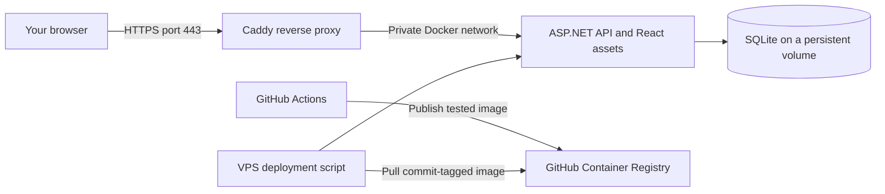

# Deploy DOD to a VPS, step by step

This guide uses a Hetzner Cloud server, Ubuntu 26.04 LTS, Docker Compose, and Caddy. The deployment files are prepared in [`deploy/vps`](../deploy/vps). For confirmed progress on our existing VPS, see the [README setup status](../README.md#current-progress--1-october-2026). The user confirmed HTTPS health and a successful manual GitHub deployment; the automatic trigger is prepared locally and awaits its first run.

## 1. Understand what we are setting up



Caddy obtains and renews HTTPS certificates for your domain and forwards requests to the application. The app's port 8080 is available only on the server's loopback interface for health checks. The database volume is `dod-production-data`, separate from your Mac's Docker volume. Caddy also has persistent volumes so its certificate state survives container replacement.

The first deployment is manual. A separate GitHub workflow deploys successful main-branch push builds automatically and also supports manual releases. It never purchases or creates infrastructure.

## 2. Create the server — in your Hetzner account

Sign in to [Hetzner Console](https://console.hetzner.cloud/), create a project named `dod`, and follow the [server creation guide](https://docs.hetzner.com/cloud/servers/getting-started/creating-a-server/).

Choose:

| Setting | Starting choice and reason |
| --- | --- |
| Location | Germany or Finland, close to Poland |
| Image | Ubuntu 26.04 LTS |
| Architecture | **x86 / Intel / AMD**; current GitHub image builds target Linux AMD64 |
| Size | A small shared server with roughly 2 vCPU and 4 GB RAM is ample for this personal app |
| Networking | Public IPv4; IPv6 can remain enabled |
| Authentication | Your SSH public key |
| Name | `dod-production` |

Check the displayed monthly price, including public IP, tax, and optional backups, before creating the paid server. Pricing and available server names change; use the checkout quote. Your Mac being Apple Silicon does not require the server to be ARM.

If you need an SSH key, run this **on your Mac**, choosing a new filename and a passphrase when prompted:

```sh
ssh-keygen -t ed25519 -f ~/.ssh/dod_vps -C "dod-vps-admin"
cat ~/.ssh/dod_vps.pub
```

Upload the `.pub` contents to Hetzner and select that key when creating the server. Keep the private file `~/.ssh/dod_vps` on your machine. Do not paste passwords, private keys, or API tokens into chat or the repository.

Add a Hetzner Cloud firewall attached to this server: allow TCP 80 and 443 publicly; initially allow TCP 22 only from your own public IP. Apply rules to IPv6 as well if used. Docker-published ports can bypass some host firewall rules, so use the provider firewall and publish only the intended ports. [Docker's firewall notes](https://docs.docker.com/engine/install/ubuntu/#firewall-limitations)

## 3. Connect and prepare Linux

Replace `SERVER_IP` with the address shown in Hetzner Console:

```sh
ssh -i ~/.ssh/dod_vps root@SERVER_IP
```

If you received a root password by email instead of selecting an SSH key, connect with `ssh root@SERVER_IP`; see the [README server setup section](../README.md#11-set-up-a-fresh-ubuntu-vps) for the password login and exact Docker installation commands.

Verify the SSH host fingerprint through the provider console before accepting it. The server's console can show the fingerprint with `ssh-keygen -lf /etc/ssh/ssh_host_ed25519_key.pub`.

The user setup below copies an existing root SSH authorized-keys file. If you initially logged in with a password, first generate your key on your Mac as described above, then create `/root/.ssh` on the VPS with mode 700 and add **only your public key** to `/root/.ssh/authorized_keys` with mode 600. Test key-based root login from another terminal before proceeding; never copy your private key to the server.

The commands below run **on the VPS**, not on your Mac:

```sh
apt update
apt upgrade -y
apt install -y curl ca-certificates
adduser deploy
usermod -aG sudo deploy
install -d -m 700 -o deploy -g deploy /home/deploy/.ssh
install -m 600 -o deploy -g deploy /root/.ssh/authorized_keys /home/deploy/.ssh/authorized_keys
install -d -m 750 -o deploy -g deploy /opt/dod
```

`adduser` prompts for a local account password. Test a **second** SSH session as `deploy` before changing SSH authentication settings. Key-only SSH and disabling direct root SSH are now verified for our current setup. On a new server, keep the original session open until a new key-based login is verified. Keep Ubuntu security updates enabled and plan reboots when required.

If Docker is already installed and the README verification commands passed, skip reinstalling it. Otherwise, use the [README's exact commands](../README.md#step-4-install-prerequisites-and-the-signing-key) to install Docker Engine and Compose, based on Docker's [official Ubuntu apt-repository instructions](https://docs.docker.com/engine/install/ubuntu/#install-using-the-apt-repository). This installs Docker Engine on Linux; do not install Docker Desktop on the server.

Then, as root:

```sh
usermod -aG docker deploy
systemctl enable --now docker
```

Log out and reconnect as `deploy` so group membership takes effect:

```sh
# On your Mac:
ssh -i ~/.ssh/dod_vps deploy@SERVER_IP

# On the VPS:
docker --version
docker compose version
```

Docker group membership effectively grants administrator-level access. Keep this server dedicated to the app and protect the SSH keys accordingly.

## 4. Point a domain at the server

Our current hostname is **`dodop.duckdns.org`**, with an A record verified as **`37.27.148.183`**. Set `DOMAIN=dodop.duckdns.org` in the production configuration; the user has verified the public HTTPS health endpoint.

For a new setup, use a DuckDNS hostname or a domain you own, for example `tracker.your-domain.com`. At your DNS provider, add an **A record** for `tracker` pointing to the server's public IPv4 address. Add an AAAA record only if the corresponding IPv6 address and firewall configuration work.

Caddy needs the hostname to resolve to the server and inbound ports 80/443 to be reachable. A purchased domain has a separate registration cost; the DuckDNS hostname we selected is free.

For early checks without a domain, use an SSH tunnel to loopback rather than exposing the app's Basic login over public HTTP. Public deployment in the supplied configuration expects a domain and HTTPS. [How Caddy automatic HTTPS works](https://caddyserver.com/docs/automatic-https)

## 5. Publish the image and copy deployment files

Commit the current app and deployment files, push to `main`, and wait for **Verify and package** to succeed in GitHub Actions. Copy the full 40-character commit SHA from that successful run. The image will be `ghcr.io/witoss/dod:COMMIT_SHA`.

The new `Deploy to VPS` workflow does not replace CI. It deploys an image that CI has already published.

From the repository root **on your Mac**:

```sh
scp -i ~/.ssh/dod_vps deploy/vps/compose.yaml deploy/vps/Caddyfile deploy/vps/common.sh deploy/vps/deploy.sh deploy/vps/backup.sh deploy/vps/.env.example deploy@SERVER_IP:/opt/dod/
```

On the VPS as `deploy`:

```sh
cd /opt/dod
cp .env.example .env
chmod 600 .env
nano .env
```

Set your real hostname, certificate contact email, and a long unique tracker password. The server's `.env` is independent of the local one. The example uses single quotes around the password to preserve literal `$` characters. Do not run `source .env`; Compose reads it as configuration.

If the GHCR package is private, the **deploy user** must authenticate on the VPS. Create a GitHub personal access token (classic) with `read:packages` and access to the package, then use `docker login ghcr.io -u YOUR_GITHUB_USERNAME` and paste the token at the password prompt. Do not put the token into a command argument, the app's `.env`, or source control. See [GHCR authentication](https://docs.github.com/en/packages/working-with-a-github-packages-registry/working-with-the-container-registry#authenticating-to-the-container-registry).

## 6. Deploy the first release

On the VPS, replace `COMMIT_SHA` with that full successful commit SHA:

```sh
cd /opt/dod
bash deploy.sh ghcr.io/witoss/dod:COMMIT_SHA
```

The script validates the image format, pulls the images, backs up an existing production data volume before an update, starts the containers, and polls the local health endpoint. A successful deployment records the image in `release.env`; the previous successful image is saved in `previous-release.env`. The scripts use a lock to prevent concurrent backup/deployment operations.

Check the public address:

```sh
curl --fail https://tracker.your-domain.com/health
```

Open the HTTPS site and sign in as `tracker` with the server password. Save a test entry, restart the app, and confirm it remains. Local health does not prove DNS or HTTPS is working, so do this public check separately.

Useful server commands after the first successful deployment:

```sh
cd /opt/dod
docker compose --env-file .env --env-file release.env logs --tail=100 app proxy
docker compose --env-file .env --env-file release.env ps
docker compose --env-file .env --env-file release.env restart app
```

If the first deployment fails before `release.env` exists, supply `APP_IMAGE=ghcr.io/witoss/dod:COMMIT_SHA` before the Compose command and omit `--env-file release.env`. Do not print `docker compose config` into shared logs: its expanded output includes secrets. Use `config --quiet` for validation.

## 7. Transfer your current journal, if desired

The server starts with an empty journal. Do not try to move a live `dod.db` file alone: SQLite may have recent data in its WAL file.

For migration, briefly stop the local app, archive the **whole local database volume**, restart the local app, transfer the archive using `scp`, and restore into an empty server data volume while the server app is stopped. Keep the local copy until the server's entries are verified. This is a deliberate data transfer step; deploying code does not automatically move your journal.

Use the restore procedure below, identifying the actual local volume with `docker volume ls`. We should do the first migration together once the server is available, to avoid overwriting any server entries you have already created.

## 8. Backup and restore

On the VPS:

```sh
cd /opt/dod
bash backup.sh
```

This is a **cold backup**: it briefly stops the app, archives the entire data volume including SQLite companion files, and restarts the app if it was running. The script attempts to restart it even if archiving fails. Caddy stays up; requests may see a brief error during the backup.

Files appear in `/opt/dod/backups/`, with restrictive permissions. Archives contain personal data. Copy them off the server using a protected channel and encrypted storage; the local backup directory alone does not protect against loss of the VPS. There is no automatic pruning, scheduled backup, or off-host upload yet. Before depending on this journal, add those with retention and failure alerts, and test a restore.

Restore first into an isolated test volume, not over your running database. On the VPS, choose an existing archive filename and a new volume name:

```sh
docker volume create dod-restore-check
# Replace ARCHIVE.tar.gz with a filename in /opt/dod/backups.
docker run --rm --network none \
  --mount type=volume,src=dod-restore-check,dst=/restore \
  --mount type=bind,src=/opt/dod/backups,dst=/backup,readonly \
  alpine:3 tar xzf /backup/ARCHIVE.tar.gz -C /restore
```

Start the corresponding app image with this restored volume at `/data`, a separate password, and a loopback-only test port. Check entries and settings before considering a production restore. A real restore requires stopping production and intentionally replacing its data with the chosen backup; it may discard changes made since that backup. Keep ownership from the archive so the non-root app can write its database.

## 9. Enable the GitHub deployment workflow

Do this after a manual server deployment works. The prepared workflow is [`.github/workflows/deploy.yml`](../.github/workflows/deploy.yml).

1. Create a GitHub environment named `production`. Restrict deployment branches to `main` and add required reviewers if your repository's plan supports them. Environment rules are configured in GitHub, not automatically created by this YAML. [GitHub environment documentation](https://docs.github.com/en/actions/reference/workflows-and-actions/deployments-and-environments)
2. Create a **separate** SSH key for deployment automation. Add its public key to the server's `deploy` user's authorized keys. Do not reuse your personal administrator private key.
3. Add the following environment secrets (or repository secrets if environment secrets are unavailable on your plan):

| Secret | Value |
| --- | --- |
| `VPS_HOST` | Server IPv4 address or hostname |
| `VPS_USER` | `deploy` |
| `VPS_SSH_KEY` | The separate automation private key, including its header/footer and newlines |
| `VPS_KNOWN_HOSTS` | A verified SSH known-hosts entry for the exact host in `VPS_HOST` |

To prepare `VPS_KNOWN_HOSTS`, collect the server's public host key, verify its fingerprint independently in the Hetzner console, then store the verified known-hosts line. Do not disable SSH host verification or trust an unverified `ssh-keyscan` result.

The cloud firewall must permit SSH from the workflow runner. Standard GitHub-hosted runners have changing addresses; an initial home-IP-only rule will block them. Decide whether to use managed runner egress through a private network, maintain suitable allow rules, or deliberately expose key-only SSH publicly. Until that is decided, continue manual deployment from your allowed IP. The workflow itself does not change firewall rules.

Run **Actions → Deploy to VPS → Run workflow**, choose branch `main`, and enter the full SHA of the desired successful `main` push build. The workflow checks that CI succeeded for that SHA, then invokes `/opt/dod/deploy.sh` over SSH. The server pulls from GHCR using its own read-only registry credentials. The app password stays on the server.

After a successful push-triggered **Verify and package** run on `main`, `workflow_run` also starts deployment automatically. The job checks the source repository, event, branch, and success result, and deploys the CI run's `head_sha`. Pull requests and manual CI runs cannot trigger automatic deployment. It skips an automatic release if `main` has moved on when checked, while manual releases can still select an older tested SHA. Deployments share a concurrency group and do not cancel an active deployment. Environment approval rules still apply.

The workflow must be pushed to the default branch before its automatic trigger is active. Check both CI and deployment after that push; the first automatic run is still pending verification. See [GitHub workflow_run documentation](https://docs.github.com/en/actions/reference/workflows-and-actions/events-that-trigger-workflows#workflow_run).

Our server now permits TCP 22 from any IPv4 after key-only authentication and disabled root login were verified. The four environment secrets are configured, and the user confirmed a green manual deployment.

 SSH credentials for a Docker-enabled user have broad server access, so limit who can edit workflows, approve deployments, and use the production secrets.

Deployment scripts and proxy configuration are installed separately with `scp`. Image deployment does not update those files. Review and copy infrastructure changes explicitly before using them.

## 10. Rollback and maintenance

`previous-release.env` identifies the last successful image. For a schema-compatible rollback, run `deploy.sh` with that previous image reference. The script does not automatically roll back after failure: a new application may have migrated the database, and an older application may reject that schema. Inspect logs, choose a compatible image, or perform a deliberate restore of a pre-deployment backup if necessary.

Keep one app instance while using this SQLite design. Rotate credentials, install OS updates, check disk usage, and monitor the public health endpoint. Docker log rotation is configured. Caddy's major-version image tag receives updates when pulled; review and schedule proxy and OS updates as part of maintenance.

The starter deployment has Basic authentication but no login-specific rate limiting. Before treating the public instance as a long-term production service, add login throttling or an identity-aware access layer alongside automated off-host backups and monitoring.
