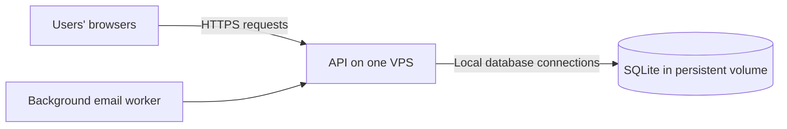

# Knowledge base

This document explains the reasoning behind dodo's technical choices. It distinguishes what the code already does from improvements to consider as the app grows. Update it when the architecture changes.

## SQLite: why it fits dodo

SQLite is a relational database engine embedded in the API process. It stores data in files rather than requiring a separate database server. It still provides SQL, transactions, indexes, foreign keys, and uniqueness constraints.

The practical reasons for using it here are:

- **Simple deployment:** one API container and a persistent data volume, without another service to configure, secure, or maintain.
- **Suitable data model:** accounts, dated entries, goal reports, weekly awards, and queued emails have relationships and consistency rules that fit a relational database.
- **Local access:** the API accesses the database on the same VPS, without a database network round trip.
- **Appropriate workload:** a journal typically has small saves and many reads. Users do not continuously stream writes into it.
- **Easy development:** the same engine runs locally, in integration tests, and in production.

These reasons explain why the current design is a reasonable fit; they are not a measured capacity guarantee. SQLite is also an established option for websites with suitable traffic patterns. Its main scaling constraint is simultaneous writing, rather than the number of registered accounts. See SQLite's [appropriate uses guide](https://sqlite.org/whentouse.html).

## Where the database lives



The worker runs inside the API process and uses the same storage layer. Browsers never open the database file directly. Many people can use the website from different machines while all database access stays on one server.

[EntryStore.cs](src/Dod.Api/Entries/EntryStore.cs) configures the path through `Storage:Path`, defaulting to `data/dod.db`. The production [Dockerfile](Dockerfile) sets `Storage__Path=/data/dod.db`. The [VPS Compose file](deploy/vps/compose.yaml) mounts the named volume `dod-production-data` at `/data`. Replacing the application container preserves that volume and its data. Deleting the volume does not.

The current production design uses **one app instance**. It has no database replication or automatic failover.

## Concurrency: what happens when requests arrive together

Concurrency means operations overlap in time. It does not mean every operation executes against the database at exactly the same moment.

SQLite allows multiple readers, but only **one writer per database file** at a time. That restriction applies across users and tables: two users saving different goals still compete for the same writer slot. A second write normally waits for the first transaction to finish. Many short writes can therefore succeed in quick succession. A long transaction can delay unrelated saves. See the [Microsoft.Data.Sqlite transaction documentation](https://learn.microsoft.com/en-us/dotnet/standard/data/sqlite/transactions).

For example, Alice and Bob can both read their journals. If they save together, Alice's transaction may acquire the writer slot first; Bob's waits, then saves after Alice commits. If Alice holds it too long, Bob's operation can time out. WAL improves overlap between reads and writes, but does not create additional writer slots.

The app creates a separate connection for each storage operation through `EntryStore.OpenAsync()`. It does not share one connection concurrently between all requests, and does not implement a global application queue for diary writes. Microsoft.Data.Sqlite retries busy/locked database operations up to the configured timeout. The app does not override its documented default of **30 seconds**. Waiting handles brief contention; it cannot fix sustained overload. See Microsoft's [database errors guide](https://learn.microsoft.com/en-us/dotnet/standard/data/sqlite/database-errors).

## WAL: why a read can coexist with a write

WAL stands for **write-ahead logging**. Initialization in `EntryStore.InitializeAsync()` requests:

```sql
PRAGMA journal_mode=WAL;
```

WAL appends changed pages and a commit marker to `dod.db-wal`. Readers use a consistent snapshot, reading the main database and relevant committed WAL pages. This allows ordinary readers and a writer to overlap. The `dod.db-shm` companion file helps locate WAL pages.

A **checkpoint** transfers committed WAL content into the main database. The app uses SQLite's automatic checkpointing rather than a custom checkpoint service; the standard threshold is 1,000 pages. Long read transactions can prevent a checkpoint from fully advancing, causing WAL growth and additional work.

WAL mode persists across database connections. All processes accessing it must be on the same host; sharing this database between VPS machines through a network filesystem is unsuitable. Do not delete companion files while the app is running. See SQLite's [WAL documentation](https://sqlite.org/wal.html).

WAL addresses read/write contention. Correct XP calculations still require the transactions, constraints, and business rules described below.

## How the app keeps related changes consistent

| Problem | Current safeguard | What it means |
| --- | --- | --- |
| A goal save succeeds but its weekly bonus update fails | Goal reporting and bonus reconciliation share one transaction | Both commit together, or neither is saved |
| Repeated requests award the same goal twice | `ActivityReports` has a key on `(UserId, ActivityId, Date)` and uses an upsert | A correction updates the existing report rather than adding another reward |
| Editing a goal definition changes historical rewards | Reports snapshot points and wording on their first save | Corrections retain the original reward value |
| Recalculating a week awards another bonus | `WeeklyAwards` has a key on `(UserId, WeekStart)` | The existing award becomes 0 or 50 XP instead of accumulating duplicates |
| Concurrent requests compute XP from inconsistent changes | The report, reconciliation, and before/after XP calculation use the same transaction | The returned adjustment corresponds to that committed operation |
| Scheduling repeats after a restart | A unique index permits one weekly outbox item per user and week | Repeated scheduling does not insert another weekly message |
| Queue processors claim the same email | An atomic database claim assigns an expiring lease | The normal claim path selects one owner; an expired lease permits recovery |
| An email provider is slow | The claim transaction commits before network delivery | Waiting for SMTP or HTTPS does not hold a database write transaction |
| A container is replaced | Database files live in the persistent volume | Storage survives application image updates |

These mechanisms are implemented in [MotivationStore.cs](src/Dod.Api/Motivation/MotivationStore.cs), [WeeklyRules.cs](src/Dod.Api/Motivation/Persistence/WeeklyRules.cs), [EntryStore.cs](src/Dod.Api/Entries/EntryStore.cs), and [EmailWorker.cs](src/Dod.Api/Notifications/EmailWorker.cs).

Foreign keys are enabled for connections, and the schema includes checks and unique keys. Schema upgrades run in a transaction and use `PRAGMA user_version` to record the version. SQL constraints defend stored data; domain rules decide when a goal or week qualifies for XP.

### Example: correcting a completed past week

Suppose a manual goal is worth 10 XP and is the final missing report in an otherwise complete, eligible, closed week:

1. Marking it complete stores the report and reconciles the week in one transaction. Total XP increases by 10 for the goal and 50 for the weekly bonus: **+60 XP**.
2. Sending the same completed state again leaves the same report and award in place: **0 XP change**.
3. Unticking it updates the report and removes the now-unearned bonus in one transaction: **−60 XP**.

Concurrent transactions execute their changes in sequence against committed state. The unique report and award rows prevent duplicate rewards. The authoritative total is calculated from completed reports and weekly awards, rather than blindly incrementing a counter on every request. See the [goals and XP guide](docs/motivation.md) for eligibility and roster rules.

## Current limitations that remain

The single-writer limit remains. The safeguards make overlapping requests consistent; they do not guarantee that every request will succeed under arbitrary load.

Some operations that appear to be reads also occupy the writer slot. The current calls to `BeginTransaction()` use the provider's non-deferred transaction behavior, reserving that slot at transaction start. `MotivationStore.GetDay()` uses this even for its read snapshot. `WeeklySummaryStore.Build()` also reconciles awards, so building a summary can actually write. WAL does not turn these operations into independent read-only transactions. Deferred transactions require care when upgrading a read to a write; changing them is a code change that needs concurrency tests. See the provider's [transaction implementation](https://github.com/dotnet/efcore/blob/main/src/Microsoft.Data.Sqlite.Core/SqliteConnection.cs) and [deferred transaction documentation](https://learn.microsoft.com/en-us/dotnet/standard/data/sqlite/transactions#deferred-transactions).

Transaction duration matters. Password reset currently computes the new password hash while its transaction is open. The worker also performs historical bonus catch-up inside a per-user transaction. These are candidates to measure if other saves start waiting. Network email delivery already happens outside the transaction.

Database queue deduplication does not promise exactly-once email delivery. A crash after a provider accepts a message but before the database records success can lead to another attempt. Provider idempotency, where supported, is a separate safeguard.

SQLite does not provide the current deployment with high availability, protection from losing the VPS disk, or automatic off-server backups. A persistent Docker volume preserves data across container replacement, but is still on that server.

## Backups and WAL files

Copying only a running database's `dod.db` can miss committed changes still in its WAL. A backup must capture a consistent database state. SQLite supports a live [online backup API](https://sqlite.org/backup.html), but this project currently uses a cold backup instead.

The [VPS backup helper](deploy/vps/common.sh) stops the app, archives the entire `/data` volume, and restarts the app if it was running. It includes any SQLite companion files and the application's persisted protection keys. Requests may briefly fail during this operation. A file lock prevents overlapping deployment/backup scripts; it does not serialize normal API database operations.

Backups currently stay in `/opt/dod/backups/` until copied elsewhere. Automatic scheduling, retention, off-server upload, and restore verification are operational work still to add. A local archive alone cannot protect against losing the whole server. Follow the [VPS backup and restore instructions](docs/vps.md).

## Why this design works for the current use case

The architecture keeps database access local, uses one application instance, makes mostly small journal changes, and keeps email network waits outside write transactions. Transactions and unique keys protect the app's complex XP rules even when requests overlap. WAL allows ordinary reads to coexist with writes.

That is a sound fit for the expected workload, rather than proof of capacity at a particular user count. A thousand mostly inactive accounts can be easier to serve than a small group performing expensive writes continuously. No production concurrency limit has been established by load testing.

SQLite has no deadline after which it must be replaced. Keep it while the measured workload and deployment requirements fit.

## When to reconsider SQLite

Investigate if saves become slow, database busy/locked errors recur, background processing delays interactive requests, or the WAL keeps growing. Measure transaction duration, request latency, database error codes, disk space, and worker progress. Review slow queries, indexes, and unnecessarily long transactions before changing engines. The app does not currently provide a dedicated database contention dashboard.

Consider PostgreSQL when the product needs sustained concurrent writing beyond what this design handles, multiple API hosts sharing one central database, or database replication and failover. These are architecture requirements, not a fixed registered-user threshold. PostgreSQL can support more overlapping writes, but still needs correct transactions and business invariants.

A migration would need schema and SQL changes, data transfer, replacement deployment and backup procedures, and verification of accounts, XP, weekly awards, and the email outbox. Keeping business rules separate from persistence makes that work easier; it does not make switching databases automatic.
